# OpenGL ES 2.0 Programming Guide sample code for Android

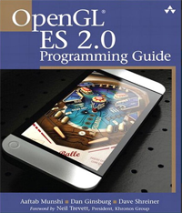
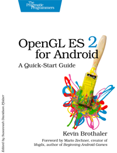

OpenGL ES2.0 programming samples for Android systems, imported into Android Studio.
These samples were compiled from the following sources:

* http://github.com/danginsburg/opengles-book-samples
* http://github.com/freedomtan/android-utah-teapot

## What has changed:

The samples have been reworked so that they all live happily (more or less) in one Android Studio project.
In theory you should be able to pull the repo or download the zip file, and then hand the (uncompressed) folder 
to Android Studio and everything should just build.  

The Ch[0-9][0-9] folders contain samples from the "Programming Guilde" book.  

### Current Studio level (17 Jan 2016):

Android Studio 1.5.1   Build date: 1 Dec 2015

compileSdkVersion 23

buildToolsVersion "23.0.2"

## License

There doesn't appear to be any sort of license language in the 2.0 version of the examples.
For the "Programming Guilde" book 3.0 version, however, one can
find an MIT type license.   Here is the 3.0 version of the *LICENSE*:

http://github.com/danginsburg/opengles3-book/blob/master/LICENSE

In any case this disclaimer certainly applies to this repo:

## DISCLAIMER

**THE SOFTWARE IS PROVIDED "AS IS", WITHOUT WARRANTY OF ANY KIND, EXPRESS OR
IMPLIED, INCLUDING BUT NOT LIMITED TO THE WARRANTIES OF MERCHANTABILITY,
FITNESS FOR A PARTICULAR PURPOSE AND NONINFRINGEMENT. IN NO EVENT SHALL THE
AUTHORS OR COPYRIGHT HOLDERS BE LIABLE FOR ANY CLAIM, DAMAGES OR OTHER
LIABILITY, WHETHER IN AN ACTION OF CONTRACT, TORT OR OTHERWISE, ARISING FROM,
OUT OF OR IN CONNECTION WITH THE SOFTWARE OR THE USE OR OTHER DEALINGS IN
THE SOFTWARE.**

## Supported Platforms 

As part of this port to Android Studio - the sample code for platforms other than Android has been 
stripped out.   Also NDK versions (if any) are not part of this port, leaving only normal Android
structures.

# The Samples:

For more information on these samples please refer to the *Book*.

## Ch02_Hello_Triangle

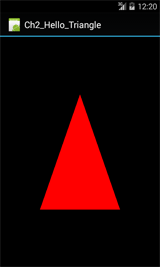

## Ch08_Simple_Vertex_Shader

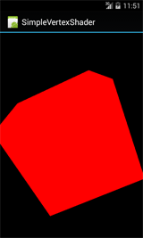

## Ch09_MipMap2D

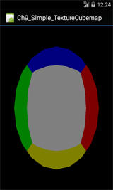

## Ch09_Simple_Texture2D

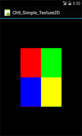

## Ch09_Simple_TextureCubemap

## Ch09_TextureWrap

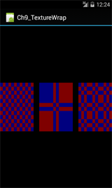

## Ch10_MultiTexture

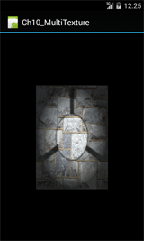

## Ch11_Stencil_Test

Note:   This one has problems on at least one AVD but works on real Android devices tested so far.

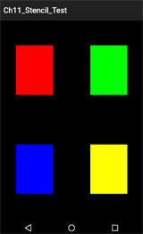

## Ch13_ParticleSystem

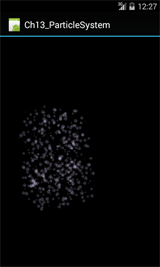

## Ch99_*Appendix01*_Teapot ES10

Note: This example is **NOT** in the book.  I added it as it is a classic image and as a study in porting from ES 1.0 to ES 2.0.

The original sources are located (archived) at:  http://code.google.com/p/android-utah-teapot/source/checkout

Also now at:

http://github.com/freedomtan/android-utah-teapot

Original poster:  http://github.com/freedomtan

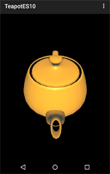

# For more information

## Stencil Buffer
"Buffers", OpenGL 1.0 slide deck (PPT), Link: http://slideplayer.com/slide/3449472

Improving Shadows and Reflections via the Stencil Buffer by MJ Kilgard (PDF)   Link: http://artis.imag.fr/Recherche/RealTimeShadows/pdf/stencil.pdf

